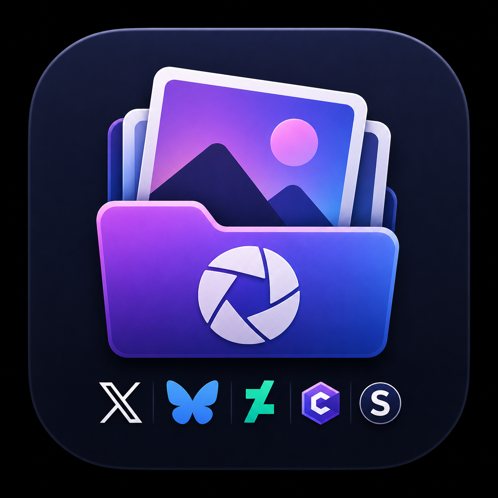

# Crosspost Helper

Local-first desktop tool for choosing AI images, tracking manual posts per network, and avoiding duplicate posting.



## Current Focus

- Index images from local folders.
- Filter images by source, folder, rating, target availability, skipped state, and excluded state.
- Preview images large before posting.
- Mark one or many selected images as posted on one or many targets.
- Exclude images from the active workflow and restore them later.
- Export selected local images into a posting folder.

## Development

```bash
npm install
npm run tauri -- dev
```

Build the macOS app bundle:

```bash
npm run tauri:build:app
```

## Author

Made by Valerie.
